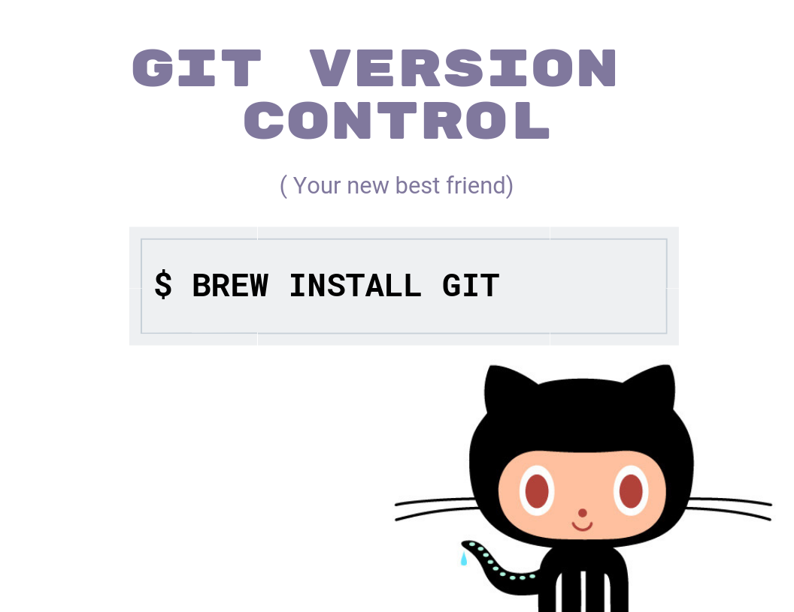

# Installfest Step 1: Development Environment Setup

## Operating System & Command Line Tools

If you don't already have an account for the Mac App Store, follow the instructions on Apple Support to [create a Mac App Store account](https://support.apple.com/kb/PH11499?locale=en_US).

Before class starts, we suggest you upgrade your operating system to OS X Yosemite (10.10), OS X El Capitan (10.11), or macOS Sierra.  If you're on an older machine with 4GB or less of memory, please stick to OS X Yosemite.  Also, if Apple releases a newer version of macOS while you're in SEI; please don't update until your instructors say it's ok.

To check which operating system you're running:

<p align="center">
  
</p>


If you are not using OS X Yosemite (10.10), OS X El Capitan (10.11), or macOS Sierra, detailed instructions for upgrading your operating system are available through Apple support: [How to upgrade to macOS Sierra](https://support.apple.com/macos)

> Please let an instructor know if you're using an older version of OS X or if your system has less than 2 GB of memory.

### Install Command Line Tools from the Terminal

<p align="center">

</p>

## Homebrew 


[Homebrew](http://brew.sh) is a *package manager* - it downloads and updates programs on your machine. We'll use it to quickly download and install other tools we need, or to update already installed tools.

1. Open the Terminal application, and run `which brew` to check if you have Homebrew installed already. The `which` Terminal command shows where on your computer a program is installed. If it is installed, the Terminal will output a file path. If it is not installed, the Terminal won't output anything.

2. **Only if you do not have Homebrew installed**, run the command below to install Homebrew. Wait while Homebrew downloads and installs.
<!--
    ```bash
    ruby -e "$(curl -fsSL https://raw.githubusercontent.com/Homebrew/install/master/install)"
    ```
--->

```bash
/bin/bash -c "$(curl -fsSL https://raw.githubusercontent.com/Homebrew/install/HEAD/install.sh)"
```
    If you run into problems, you may need to run `rm -rf /usr/local/Cellar /usr/local/.git` and then retry the command above.

3. Run `brew update` to update Homebrew.

4. Run `brew doctor` in your Terminal to check that Homebrew and any current packages are installed correctly. If there are issues, `brew doctor` will list suggestions for how to fix them.  Follow these suggestions one by one. If you're not sure what to do, **ask!**

5. Based on the errors in the step above, you may need to edit your `~/.bash_profile` to include the path to Homebrew if `brew doctor` shows warnings.  If in doubt ask for help here.

    ```bash
    echo 'export PATH="/usr/local/bin:/usr/local/sbin:~/bin:$PATH"' >> ~/.bash_profile
    ```

6. Let's install our first package with Homebrew, `tree`!  This package adds a command to your Terminal that displays files in a tree view (instead of a list view like `ls`).  Enter the following command in your Terminal:

  ```bash
  tree
  ```
It will tell you that this command is not found or it just won't do anything. This is because it's not a program (command) that's installed on your machine. Now install it with this command:

  ```bash
  brew install tree
  ```

7. Now run the Terminal command `tree` to see a tree view of all the files inside your current directory!

  >If you run `tree` from your root directory, it might be printing files for a LONG time! Remember that you can always use `ctrl + C` in the terminal to stop the currently running process.

8. `trash` is another Homebrew package that easily allows one to move files or folders into the trash bin from the terminal. This is good practice because [other commands](http://docstore.mik.ua/orelly/unix3/upt/ch14_03.htm) may be more dangerious. Again, the `trash` tool does not permanently delete files or folders, but simply places them in the trash. Let's install it using homebrew with the command:

    ```bash
    brew install trash
    ```

    We can test this by creating a file and moving our dummy file into our trash bin. Run these lines in your terminal to see the power of `trash`:

    ```bash
    touch new-trash-file.txt
    ls
    ```

    You should see the newly created file.

    ```
    trash new-trash-file.txt
    ls
    ```

    Now it's moved to the trash bin!

## Customization

### Styles (Optional)

If you haven't done anything to personalize the terminal yet that's fine, but it will probably look a little boring (and hard to read). We recommend adding some styles to the bash shell. [Solarized](http://ethanschoonover.com/solarized) is a great theme for this purpose.

1. [Download](http://ethanschoonover.com/solarized/files/solarized.zip) the zip file of all the themes.
2. Unzip it by double-clicking
3. Open your the Terminal Application and navigate to `Terminal` -> `Preferences`. Navigate to the `Profiles` tab. In the bottom left hand corner, find the icon that looks like a cog/gear and select `Import...`.
4. Navigate to the unzipped solarized directory and navigate into the sub-directory `osx-terminal.app-colors-solarized` and select `Solarized Dark ansi.terminal`.
5. Finally, click the button `Default` next to the cog/gear icon, which will set this to your default theme.

Try opening up a new window for the Terminal and ensure the color scheme has been updated.

Style it! Make it your own! 
Other options are [Hyper Terminal](https://hyper.is/) and [ZSH](https://ohmyz.sh/)

<p align="center">

</p>


## Git

You should already have git installed and have an account on GitHub from Fundamentals. If not, sign up for an account on [github.com](http://github.com). We'll be using GitHub to track code changes and collaborate on projects.

<p align="center">

</p>

### Confirm Install

1. To check whether git is installed on your system, run the Terminal command `which git`. The output should be a directory path like `/usr/bin/git`. This is where git is installed on your machine. If you don't see any output, git is not installed on your computer.

### Configure Git

Configuring your git settings will help GitHub track your contributions and to make it easier and smoother to commit changes.

1. Use the following three `git config` commands to configure your git user information and have git "cache" (remember) it. We use the `--global` (or `-g`) option to make the configuration apply to all repositories.

<p align="center">

</p>

To view your git configurations, you can either run following commands on the terminal

```
git config --list
```
OR

```
git config user.name
git config user.email
```

## Next Up
* [Install Development Tools](../mac-dev-tools/README.md)

